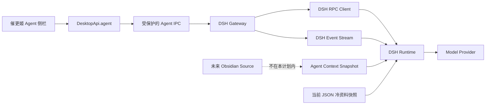

# 10. DSH 原生侧栏改造计划

> 文档状态：历史实施计划；Phase 0–6 已按本计划完成，当前结果见 [native-dsh-sidebar/phase-6-result.md](./native-dsh-sidebar/phase-6-result.md)。  
> 适用范围：仅改造 DSH Agent 链路，不接入 Obsidian，不迁移 Automation 快捷任务  
> 目标平台：Electron；不为网页版保留 Agent 入口

## 1. 为什么需要再次改造

当前版本已经让 DeepSeek Harness 接管 Agent Runtime，但前端采用 `WebContentsView` 将 DSH 官方 Web UI 整页投影到右侧窄栏。真实运行验证说明：

1. DSH 子进程、模型请求和基本会话可以工作。
2. 侧栏实际宽度约 419 px，DSH 自带导航继续占用约 56 px，可用对话区只剩约 363 px。
3. 官方页面带有 workspace、session、搜索、设置等完整工作台结构，并不是为小说编辑器窄侧栏设计的。
4. 额外 WebContents 会增加渲染、布局同步和焦点管理成本，侧栏切换与输入体验容易出现卡顿。
5. DSH 重启、凭据刷新与嵌入视图显隐目前属于三套状态，已经出现“运行时已恢复但视图仍隐藏”的竞态。
6. 真实模型请求验证发现，自定义冷资料工具没有进入最终模型请求。现有插件单测只证明插件可注册，不能证明 DSH 实际组装请求时仍保留工具。

因此，当前实现只能作为 DSH 接入验证，不作为最终产品形态。

## 2. 最终决策

采用“DSH 后台能力 + 催更姬原生侧栏”的方案：

- 保留 DSH：Agent Loop、session event log、模型路由、queue/steer/cancel、工具流水线、compaction 和插件系统。
- 不复用 DSH 完整网页，也不在 Renderer 中加载 DSH React UI 包。
- 催更姬根据 DSH 的视觉语言重新实现适合窄侧栏的原生界面，而不是复制其完整信息架构。
- Electron Main 是 DSH 唯一可信客户端；Renderer 不知道 DSH 端口，也不能直接调用 `/api/*`。
- Main 将 DSH RPC 和原始事件映射为催更姬稳定的 `DesktopApi.agent` 契约。
- DSH 当前仍可由私有本机 API Host 承载，但这个 Host 只作为进程间传输层，不再作为用户网页。等稳定契约完成后，再单独评估是否换成真正的无 Web Host 组合；这不阻塞侧栏改造。
- Obsidian 属于 `knowledge source`，不属于 DSH Runtime。本计划不读取 Vault、不新增 Obsidian 接口、不让 DSH 直接依赖 Obsidian。

选择自有前端而不是直接复用 DSH React 组件的原因：当前 Renderer 是原生 JavaScript，直接引入 DSH UI 组件会同时引入 React、Shiki、KaTeX 等运行依赖，仍然会形成第二套前端运行体系。我们只吸收其布局、色彩、按钮、状态胶囊和工具卡片的设计思路。

## 3. 目标结构



边界要求：

- UI 只消费 `AgentUiEvent`，不判断 DSH 原始事件字符串。
- Gateway 只负责协议、生命周期和事件投影，不读取业务 JSON。
- Context Service 负责生成热上下文与冷资料快照，不启动 DSH。
- DSH 插件只读取已生成的只读快照，不自行访问项目目录。
- 模型密钥只存在于 Main/DSH 子进程边界，永不进入 IPC 返回值。

## 4. 目录落点

不新增正式后端模块，仍属于四类八模块中的 `intelligence/agent`。只在模块内部按能力拆分。

```text
electron/intelligence/agent/dsh/
├─ dsh-supervisor.js          # 子进程生命周期、串行启停、崩溃恢复
├─ dsh-gateway.js             # 对 IPC 提供稳定的 Agent 用例
├─ dsh-rpc-client.js          # 私有 /api RPC；不含业务判断
├─ dsh-event-stream.js        # 私有事件流、断线续接、序号校验
├─ dsh-event-mapper.js        # DSH Event -> AgentUiEvent
├─ dsh-session-registry.js    # project/workspace/session 映射
└─ plugins/                   # 催更姬 preset 插件

shared/desktop-api/intelligence/agent/
├─ agent.contract.js          # DSH Agent 命令频道和 DTO
├─ agent-events.contract.js   # DSH Agent 语义事件（需要时新增）
└─ sessions.contract.js       # 现有业务 content session；本计划不混合

electron/ipc/intelligence/agent/
├─ agent.handlers.js          # DSH Agent 命令入口
└─ sessions.handlers.js       # 现有业务 content session；本计划不混合

public/js/modules/intelligence/agent/
├─ workbench/
│  └─ agent-workbench.js      # 侧栏编排和生命周期
├─ conversation/
│  └─ agent-conversation.js   # 消息、reasoning、工具卡片投影
├─ composer/
│  └─ agent-composer.js       # 输入、queue、steer、cancel
├─ state/
│  └─ agent-store.js          # 纯状态归并，可重放测试
└─ agent-sidebar.css          # Agent 独立样式边界
```

上述文件是目标边界，不要求为了目录好看而一次性创建空文件。只有出现真实职责时才落盘。

## 5. 稳定接口草案

Renderer 可见的能力建议收敛为：

```text
agent.status()
agent.openProject({ projectId, chapterId })
agent.listSessions({ projectId })
agent.createSession({ projectId })
agent.getHistory({ sessionId, beforeSeq?, maxMessages? })
agent.prompt({ sessionId, text, mode: 'queue' | 'steer' })
agent.cancel({ sessionId })
agent.refreshContext({ projectId, chapterId })
agent.restart({ projectId, chapterId })
agent.stop()
agent.onEvent(listener)
```

明确删除的视图型接口：

```text
agent.setViewLayout(...)
agent.hideView()
```

接口不返回 `runtimeUrl`、DSH 原始 workspace 对象、密钥、preset 文件路径或 DSH 内部类型。

建议的 UI 事件最小集合：

```text
runtime.state
session.ready
turn.started
message.user
assistant.delta
assistant.completed
tool.started
tool.completed
turn.completed
turn.failed
```

`assistant.delta` 可以区分 `text` 与 `reasoning`，但 UI 不依赖供应商专用 chunk。DSH 以后升级时，只修改 mapper 和契约测试。

## 6. 侧栏可见效果

第一版专门服务 360–520 px 宽度，不包含 DSH 左侧全局导航：

```text
┌──────────────────────────────────┐
│ ● Agent              ＋  ···     │
│ 当前章节：第十二章 · 上下文已同步 │
├──────────────────────────────────┤
│                                  │
│  你                              │
│  帮我检查这段冲突是否符合人物动机  │
│                                  │
│  催更姬                          │
│  [思考过程 ▸]                    │
│  人物当前的拒绝是成立的，但……     │
│                                  │
│  ◉ 查询项目资料                  │
│    角色：林晚 · 已完成            │
│                                  │
├──────────────────────────────────┤
│ [已注入：当前章节 + 项目摘要]      │
│ ┌──────────────────────────────┐ │
│ │ 输入问题，Enter 发送……       │ │
│ └──────────────────────────────┘ │
│  Agent 正在回复              ■   │
└──────────────────────────────────┘
```

视觉原则：

- 延续 DSH 的克制暗色、圆角胶囊、低噪声分隔和折叠式工具卡片。
- 侧栏只保留小说创作必要操作；workspace 管理、插件设置、全局搜索不塞入此处。
- 用户消息立即本地回显；assistant 按 delta 原位增长，不反复重建整段 DOM。
- reasoning 默认折叠，工具参数默认摘要，错误才展开详情。
- 无密钥、启动中、断线、取消中分别显示明确状态，不用一个通用“启动失败”覆盖所有情况。
- 新会话入口放在标题栏；历史会话使用轻量弹层，不常驻占宽。

## 7. 分阶段实施

每个阶段单独提交、单独验收。上一阶段未通过，不进入下一阶段。

逐阶段执行文档索引见 [native-dsh-sidebar/README.md](./native-dsh-sidebar/README.md)。

### Phase 0：[协议实证与当前基线冻结](./native-dsh-sidebar/phase-0-protocol-baseline.md)

目标：不改用户界面，先证明后台链路可作为长期基底。

工作：

1. 用本地 mock provider 跑真实 DSH prompt，而不是只测插件对象。
2. 记录 `session.history`、`events.mux`、prompt、cancel、queue/steer 的真实数据形状。
3. 修复两个项目资料工具没有进入最终模型请求的问题。
4. 验证热上下文刷新后，下一次请求读取到新快照且不清空 session。
5. 将 start/open/restart/stop 放入同一串行生命周期，消除并发启动和凭据刷新竞态。

可见效果：界面暂不变化；测试报告能展示真实请求包含的 system prompt、两个工具 schema、流式事件顺序及取消结果。

验收门槛：

- 真实请求中只出现允许的两个资料工具，不出现 Shell、任意文件系统、网页或子 Agent 工具。
- 无工具、少工具和越权工具三种情况都能明确判定。
- 连续执行 open/restart/open 不产生两个子进程，不返回泛化竞态错误。
- 保存新 API Key 后，下一次打开一定使用新配置。

回退：只涉及后台修复和测试；保留现有 WebContentsView，不切 UI。

### Phase 1：[Main 语义网关](./native-dsh-sidebar/phase-1-main-gateway.md)

目标：建立一个不依赖 DSH 网页的完整 Main 侧客户端。

工作：

1. 抽出 `dsh-rpc-client`，集中处理 rpcId、超时、错误码和敏感信息清理。
2. 接入私有事件流，建立自动重连、session 过滤和 seq 缺口补历史机制。
3. 建立 project -> workspace -> active session 映射。
4. 将 DSH 原始事件转换为稳定 `AgentUiEvent`。
5. Gateway 提供 open/list/create/history/prompt/cancel/refresh/restart/stop 用例。

可见效果：官方 DSH UI 仍可作为临时回退界面，但测试可通过语义 Gateway 完成一整轮对话。

验收门槛：

- Renderer 不参与的情况下，Gateway 能创建/恢复会话、发送、流式收取、取消和重放。
- 事件流断开后可自动续接；发现 seq 缺口时用 history 补齐且不重复展示。
- 返回错误不含 API Key、DSH 本机 URL 或用户绝对路径。

回退：IPC 仍指向旧 openWorkbench；新 Gateway 不进入生产入口。

### Phase 2：[Desktop API 契约切换](./native-dsh-sidebar/phase-2-desktop-api.md)

目标：让 Renderer 只看催更姬语义，不看 DSH 细节。

工作：

1. 增加会话、历史、prompt、cancel 和 `onEvent` 固定频道。
2. 对所有输入做长度、枚举、项目/session 身份校验。
3. preload 只注册固定事件频道，并返回可注销 listener。
4. 建立契约测试：命令白名单、错误映射、事件清洗、窗口来源校验。

可见效果：用户界面仍不切换；开发测试页或自动化测试可只用 `DesktopApi.agent` 完成对话。

验收门槛：

- Renderer 源码中不存在 DSH URL、`/api/session.*`、EventSource/WebSocket 直连。
- 关闭窗口后 listener 全部注销，没有事件继续发往已销毁 webContents。
- DSH 升级造成的原始字段变化不会直接传播到 Renderer。

回退：保留旧视图接口一个阶段，但标记 deprecated，不再新增调用。

### Phase 3：[原生侧栏视觉壳](./native-dsh-sidebar/phase-3-native-ui-shell.md)

目标：先确认实际观感、密度和操作位置，再接管生产发送。

工作：

1. 按第 6 节线框实现原生 HTML/CSS 和空状态。
2. 用固定假数据展示 user、assistant、reasoning、tool、error、streaming 六种状态。
3. 实测侧栏最窄/常用/最宽三种宽度，以及系统缩放 100%/125%/150%。
4. 保持编辑器、章节树和其他右侧标签不变。

可见效果：可以直接审阅新 Agent 面板的样式和操作，不发真实模型请求。

验收门槛：

- 360 px 下不出现横向滚动，输入区与停止按钮可用。
- 长文本、长工具名和中文标点不撑破布局。
- 切换标签和拖动侧栏时不依赖 Main 同步 bounds。
- 视觉评审通过后才进入 Phase 4。

回退：关闭内部开关即恢复官方嵌入视图。

### Phase 4：[流式交互接管](./native-dsh-sidebar/phase-4-streaming-takeover.md)

目标：让原生侧栏完成真实对话，官方 GUI 不再承担用户交互。

工作：

1. `agent-store` 通过 history 建立初始状态，再归并实时事件。
2. 输入框支持 Enter 发送、Shift+Enter 换行、回复中 queue/steer 和 cancel。
3. 对 delta 做批量帧刷新，避免每个 token 引发完整 DOM 重排。
4. 支持 session 新建、恢复、空会话复用和历史分页。
5. 章节变化继续走 `refreshContext`，不自动清空当前对话。

可见效果：新侧栏可完成日常问答、连续上下文、停止回复和恢复历史；DSH 官方页面不再显示。

验收门槛：

- 用户消息本地即时出现；流式文字平滑增长，不整栏闪烁。
- 同一批历史 + 实时事件重放两次，得到相同 UI 状态。
- 在生成时切换章节、切换标签、缩放窗口，不丢消息、不出现重复消息。
- DSH 崩溃只让 Agent 面板进入可重试状态，不影响正文保存和项目操作。

回退：一个版本内保留内部 `legacy embedded view` 开关，只用于诊断，不暴露给普通用户。

### Phase 5：[移除官方 Web UI 生产路径](./native-dsh-sidebar/phase-5-remove-web-ui.md)

目标：结束双轨，删除额外 WebContents 和布局 IPC。

工作：

1. 从 Electron 入口移除 `dsh-view-host` 的创建、挂载和销毁。
2. 删除 `setViewLayout`、`hideView` 以及 Renderer resize/visibility 同步代码。
3. 删除官方嵌入 smoke，换成原生侧栏端到端测试。
4. 更新生产运行闭包和交接文档。
5. 评估 DSH Host 是否继续作为私有 API 进程；如需换成纯 Headless 组合，另立小阶段，不与 UI 删除捆绑。

可见效果：整个应用只有一个 Renderer；Agent 与其他侧栏标签使用同一套 DOM、主题和焦点模型。

验收门槛：

- 生产代码不创建 Agent `WebContentsView`，不加载 DSH HTML/JS/CSS。
- Agent 完整端到端测试、架构检查、lint 和 Electron smoke 全部通过。
- 安装包启动、退出和 DSH 崩溃恢复不残留子进程。

回退：回退整个阶段提交；不在删除过程中保留一半视图宿主代码。

### Phase 6：[稳定化与上游升级护栏](./native-dsh-sidebar/phase-6-stabilization.md)

目标：把 DSH 从“能用的依赖”变成“可维护的基底”。

工作：

1. 建立 DSH Contract Suite：事件顺序、history 分页、工具权限、cancel、queue/steer、compaction、session replay。
2. 固定 DSH 精确版本；升级只改 Adapter，不跨过 Gateway 直接改 UI。
3. 增加内存、首个 delta 延迟、长会话重放和 30 分钟连续流式测试。
4. 明确日志留存、敏感字段清理和诊断导出格式。

可见效果：普通使用无新增功能，但后续升级和定位问题更可控。

验收门槛：上游升级必须先通过 Contract Suite，失败时继续使用已固定版本。

## 8. 测试矩阵

| 层级 | 必测内容 |
|---|---|
| Plugin | 热上下文、冷资料搜索/读取、tool guard、小说 compaction |
| DSH 实证 | 最终模型请求的 system/tools、流式事件、取消、重放 |
| Gateway | RPC 错误、事件续接、seq 去重/补洞、生命周期串行化 |
| IPC | 来源窗口、输入校验、固定频道、错误脱敏、listener 注销 |
| Store | history + live event 幂等归并、未知事件兼容、turn 状态机 |
| UI | 窄栏、长文本、IME 输入、流式更新、reasoning/tool 折叠 |
| Electron E2E | 项目打开、发送、停止、切章节、重启、崩溃恢复、退出 |
| Architecture | Renderer 不直连 DSH、不导入 Node、不恢复 Web Agent 路径 |

不能再用“插件注册成功”代替“最终模型请求中确实有工具”，两类测试必须同时存在。

## 9. 性能与安全门槛

实施前记录当前官方嵌入方案基线，Phase 5 用同一环境复测。至少关注：

- Agent 标签首次打开耗时。
- 发送后本地用户消息出现耗时。
- Provider 返回首块到侧栏绘制的附加耗时。
- 10,000 字历史加载、连续流式输出时的 Renderer 主线程长任务。
- 打开 Agent 前后进程数、WebContents 数和内存增量。

目标不是承诺网络首字速度，而是让催更姬自身增加的 IPC 与渲染开销稳定且可测。安全要求保持：

- DSH 仅监听 loopback，端口不出 Main。
- Renderer 无密钥、无任意 RPC、无任意事件订阅能力。
- 工具权限由隔离 preset + 最终工具面审计 + guard + read-only sandbox 共同限制，不靠系统提示词。
- Agent 不能直接写章节、世界书、角色卡或未来 Vault；写入能力必须以后另立受审计命令。

## 10. 明确不在本轮做的事情

- 不接入 Obsidian Vault。
- 不让 DSH 直接读取 Obsidian 或项目文件。
- 不迁移提取、摘要、灵感等 Automation 快捷任务。
- 不重写编辑器、章节树或整个 Renderer 框架。
- 不引入 React 只为使用 DSH UI 组件。
- 不在 UI 改造时同时升级 DSH 大版本。
- 不把 Agent session 与当前业务 `sessions` 模块强行合并。

## 11. 建议评审点

正式实施前只需要确认四项：

1. 接受“参考 DSH 视觉语言、自建窄侧栏 UI”，不直接复用其 React 前端。
2. 接受 Phase 0 必须先修复真实请求缺少工具的问题，未通过不做 UI 接管。
3. 接受官方嵌入视图只保留到 Phase 5，之后从生产路径完全删除。
4. 接受 Obsidian 继续独立，等 DSH 侧栏稳定后再设计 `Knowledge Source -> Snapshot` 接入。

确认后按 Phase 0 开始；每完成一个阶段先提交可验证结果，再进入下一阶段。
